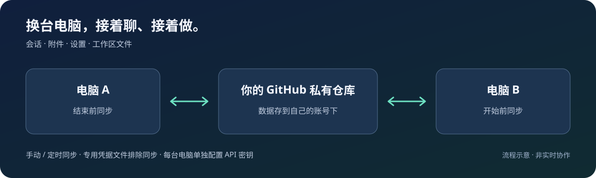

<div align="center">

# DSH Sync

### 换台电脑，接着做。

**会话、附件、设置、项目文件，一起带到下一台电脑。**
为个人多机使用而做的 DeepSeek Harness 同步插件，数据放在你自己的 GitHub 私有仓库。

[](https://www.npmjs.com/package/dsh-sync-plugin)
[](#兼容性)
[](LICENSE)

[开始使用](#开始使用) · [接入第二台电脑](#接入第二台电脑) · [使用指南](docs/getting-started.md) · [English](README.en.md)

</div>



## 不止把聊天记录搬过去

台式机上讨论到一半的方案、会话里的附件、正在修改的项目文件——换到笔记本，也能继续处理同一份工作。

| 你想继续的事 | DSH Sync 帮你带过去什么 |
| --- | --- |
| 接着聊 | 会话记录、附件，以及会话与工作区的对应关系 |
| 接着做 | 工作区里的实际文件；可在新电脑上「换位置」 |
| 少配一遍 | 模型与界面设置、插件清单；API 密钥和依赖在各机配置 |
| 自己掌握数据 | 通过自己的 GitHub 私有仓库传输；上传前核实私有状态 |
| 少做日常操作 | 手动同步或自动同步；设置页切换模式，保存即生效 |

支持的会话与配置会自动合并；普通文件冲突有明确的本机优先与备份策略，详见[合并边界](docs/sync-content.md#合并与恢复边界)。适合个人多台电脑交替使用，不是多人实时协作工具。

## 开始使用

准备好 **DSH Web、Git 和 [GitHub CLI](https://cli.github.com/)**，在运行 DSH 的同一台电脑、同一系统用户下执行：

```sh
dsh plugin --profile web add dsh-sync-plugin
gh auth login
gh auth status
```

登录选择 **GitHub.com → HTTPS**，然后重启 DSH。

**点侧栏左下角「⟳ 同步」即可开始。** 未配置仓库时，插件会尝试创建或复用账号下的私有 `dsh-sync` 仓库，并保存地址。

打开 **设置 → 同步**，确认仓库地址正确、同步完成、工作区没有失败。显示「本地快照」只代表本机保存成功，还没有传到云端。

> 默认包含工作区文件。只想同步会话与设置？首次同步前关闭「同步工作区文件」。已有仓库、使用 SSH 或网络需要代理，请看[安装与排障指南](docs/getting-started.md)。

## 接入第二台电脑

1. 安装 DSH Web、Git、GitHub CLI 和本插件，重启 DSH。
2. 执行 `gh auth login` 登录同一 GitHub 账号。默认仓库可自动复用；自定义仓库需填写相同的 `remote` 和 `branch`。
3. 点「⟳ 同步」，确认成功后重启 DSH，让取回的会话索引与设置完整加载。
4. 配置这台机器的 API 密钥、安装插件和项目依赖。项目路径不同，可在同步结果中使用「换位置」。

**试一下：** A 新建测试会话 → A 同步 → B 同步 → B 找到会话；再从 B 新建会话同步回 A，完成双向验证。

## 日常只需记住两件事

**开始前同步，结束后同步。** 两台电脑交替工作，先把上一台的更改推上去，再从下一台取回来。

**想省去手动操作，就打开自动模式。** 设置 → 同步 → 同步偏好，选择自动并保存，无需重启。默认每 5 分钟同步，也会响应会话活动。切回手动会停止后续自动调度，正在进行的同步仍会完成。

## 同步什么，留下什么

| 同步 | 留在本机 / 需要另行处理 |
| --- | --- |
| 会话、附件、工作区登记 | 专用凭据文件 `.credentials.yaml` |
| 工作区文件（可关闭） | `node_modules` 等依赖与缓存 |
| 模型、界面设置与插件清单 | API 密钥配置、插件和项目依赖安装 |
| 用户提供的托管补丁 | 本机工作区路径覆盖 |

排除凭据文件不等于扫描所有秘密：会话、附件或 `.env` 内的密钥仍可能上传。首次使用请检查[同步范围与排除规则](docs/sync-content.md)。同步会传播删除与错误修改，重要资料仍需独立备份。

## 兼容性

| 项目 | 要求或验证范围 |
| --- | --- |
| 宿主 | DSH **Web profile**，包声明 `engines.dsh >=0.1.5-rc.3` |
| Node.js | 声明 ≥20；推荐 **24**，压缩会话合并需要 Zstandard 支持 |
| 传输 | Git + 已登录的 GitHub CLI + 可访问 GitHub 的网络 |
| 自动化验证 | 本地 Git 多副本恢复、故障重试、私有仓库校验替身、设置交互与调度切换 |
| 实机范围 | 不将本地仿真等同于真实 GitHub 双机验收；详见[验证记录](docs/release-0.12.5-validation.md) |

市场的最低宿主声明用于安装前判断，不代表全部更高版本和操作系统组合都已实测。

## 遇到问题？先看这里

| 现象 | 先做这一步 |
| --- | --- |
| 没有同步按钮 | 确认装在 `web` profile，重启 DSH 并刷新页面 |
| 只有本地快照 | 执行 `gh auth status`，检查设置页仓库地址与错误 |
| 第二台没有会话 | 先同步 A 再同步 B，核对仓库 / 分支，然后重启 B |
| 工作区同步失败 | 查看具体工作区错误，修复网络或路径后重试 |

[完整排障](docs/getting-started.md#常见问题) · [配置参考](docs/configuration.md) · [更新记录](CHANGELOG.md) · [开发与验证](CONTRIBUTING.md)

```sh
# 升级后重启 DSH
dsh plugin --profile web update dsh-sync-plugin
```

如果它帮你省去了换机搬运的麻烦，欢迎给项目一个 **Star**。遇到卡点，请[提交 Issue](https://github.com/dpskk2/dsh-sync-plugin/issues)，附上宿主版本、操作步骤和脱敏错误，帮助下一位用户少走一步弯路。
